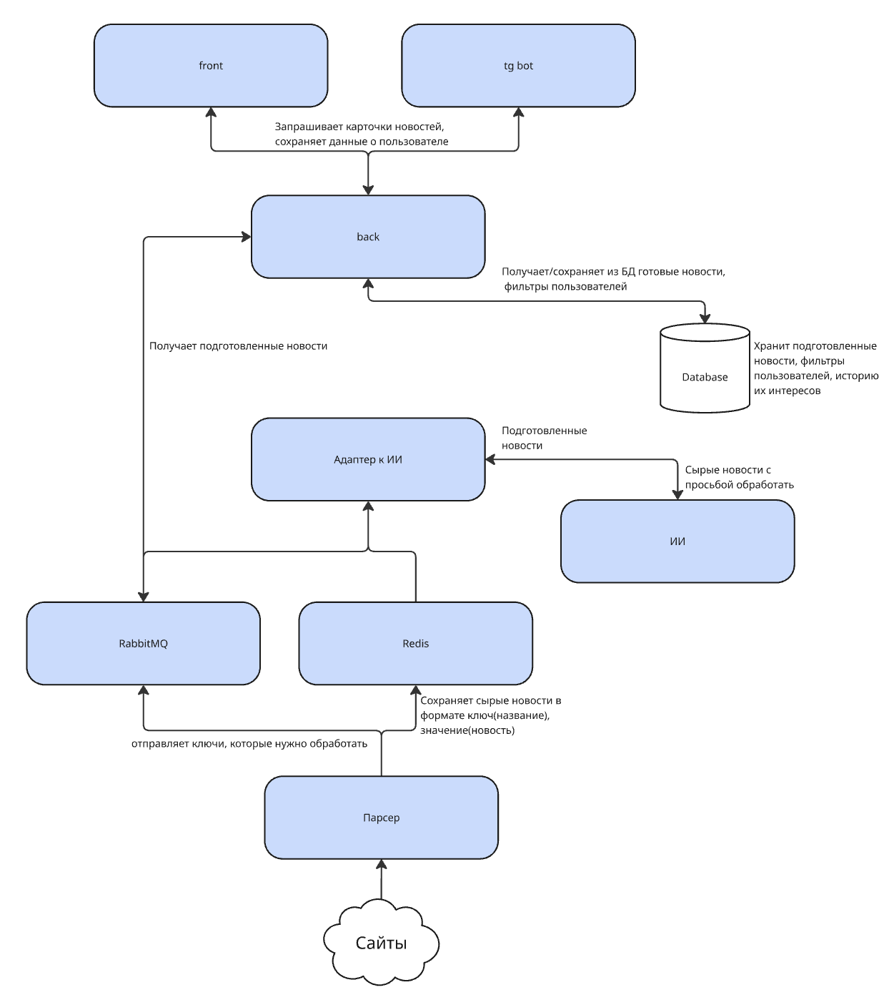

# News Hunters

## О проекте:

News Hunters — это умный агрегатор новостей, который собирает публикации с разных источников и формирует для пользователя краткие и персонализированные сводки.
Задача проекта — избавить пользователя от бесконечной ленты новостей, предоставив сжатую и удобную подборку по интересам.

🌐 **Веб-версия**: [https://dashboard2.news-hunter.ru](https://dashboard2.news-hunter.ru/)

🤖 **Telegram-бот**: [@match_hunters_bot](https://t.me/match_hunters_bot)

### Основной функционал на сайте: 
- Фильтры для новостей
- Выбор категорий (политика, спорт, наука, культура и др.)
- Выбор источников (20 популярных новостных сайтов)
- Поиск по ключевым словам
- Фильтрация по диапазону дат
- Возможность сохранить фильтры и восстановить их позже

### Персонализация:
- Авторизация через Telegram
- Формирование персонализированной ленты новостей на основе интересов пользователя (новость считается интересной, если пользователь перешёл по ней к источнику)
- Система рекомендаций на основе сходства векторных представлений новостей с интересами пользователя. Каждая новость преобразуется в числовой вектор по содержимому и категории, а профиль пользователя строится как усреднённый вектор его ранее просмотренных новостей с учётом временного затухания интереса. Рекомендации ранжируются по комбинации контентного сходства и свежести новости.

### Лента новостей:
- Бесконечная прокрутка ленты
- Каждая карточка новости содержит:
  - Заголовок  
  - Краткое описание (2–3 предложения)  
  - Категорию 
  - Дату публикации  
  - Переход к источнику по клику на карточку


### Функционал Telegram-бота:
Телеграм-бот предоставляет пользователю удобный мобильный интерфейс для взаимодействия с нашим сервисом, который позволяет:
- Задавать фильтры (категории, источники, ключевые слова)
- Сохранять, получать сохраненные фильтры (например после их сохранения на сайте) и сбрасывать фильтры
- Получение новостей по фильтрам
- Получение персонализированной ленты новостей

## 2. Общая архитектура




Система News Hunters состоит из нескольких основных модулей, которые взаимодействуют между собой:

- Интерфейс взимодействия с пользователем –
Включает веб-сайт и Telegram-бот, через которые пользователи взаимодействуют с системой. Отвечает за отображение новостной ленты, фильтров, авторизацию и персональные рекомендации.
Веб-версия предоставляет удобный интерфейс с бесконечной прокруткой, а бот — упрощённый вариант функционала с возможностью быстро получать новости прямо в Telegram.

- Бэкенд – Является связующим звеном между базой данных, модулем ИИ и пользовательскими интерфейсами. Обрабатывает запросы от сайта и Telegram-бота: выдаёт новости, применяет фильтры, формирует персонализированные подборки, управляет сохранением пользовательских настроек и авторизацией. Также обеспечивает API для взаимодействия всех модулей.

- Парсер – Отвечает за регулярный сбор новостей с заданных источников. Через заданные интервалы времени модуль обращается к новостным сайтам, получает новые публикации и передаёт их в модуль ИИ для обработки (через RabbitMQ отправлются ключи к новостям, которые нужно обработать, новости откправляются через Reddis в формате заголовок новости – ключ, новость – значение).

- Адаптер для ИИ (модуль обработки новостей) – Принимает свежие новости от парсера, формирует для каждой из них: заголовок, краткое описание (2–3 предложения, передающие суть), основные метаданные (дата, категория, источник). После генерации отправляет подготовленную новость через redis на backend.

- ИИ – Локально развернутая модель, которая саммаризирует новости


### 3. Структура проекта

```
├── Aimanager - Адаптер к ИИ
├── backend
│   ├── app
│   │   ├── alembic - Миграции
│   │   ├── api
│   │   │   └── routes - Обработчики
│   │   ├── core - Настройки бд
│   │   ├── rabbitmq - Настройка потребления подготовленных новостей с адаптера
│   │   └── recommendation_system - Библеотека для рекомендаций
│   ├── scripts
├── frontend - Фронтенд
│   ├── blob-report
│   ├── public
│   │   ├── fonts
│   │   └── images
│   ├── src
│   │   ├── components
│   │   │   ├── common
│   │   │   │   └── ToastNotify
│   │   │   ├── Filters
│   │   │   │   ├── ApplyFiltersButton
│   │   │   │   ├── CategoryPicker
│   │   │   │   ├── ClearFiltersButton
│   │   │   │   ├── DateRangePicker
│   │   │   │   ├── KeywordSearch
│   │   │   │   ├── LoadFiltersButton
│   │   │   │   ├── RecommendedNewsButton
│   │   │   │   ├── SaveFiltersButton
│   │   │   │   ├── SortOrder
│   │   │   │   └── SourcePicker
│   │   │   ├── Header
│   │   │   ├── News
│   │   │   └── TelegramAuthModal
│   │   ├── hooks
│   │   ├── styles
│   │   └── types
│   └── test-results
├── hooks
├── img
├── parser - Парсер новостей
├── scripts
└── tgbot - Телеграмм бот
```

## Технологии

*   **Backend:** Python, FastAPI, SQLAlchemy, Alembic, PostgreSQL
*   **Frontend:** React, TypeScript
*   **AI:** Локально развернутая LLM-модель (RuBERT (русскоязычная версия BERT))
*   **Парсер:** Python, feedparser, newspaper3k
*   **Инфраструктура:** Redis, RabbitMQ, Docker
*   **Tg-бот:** Aiogram
